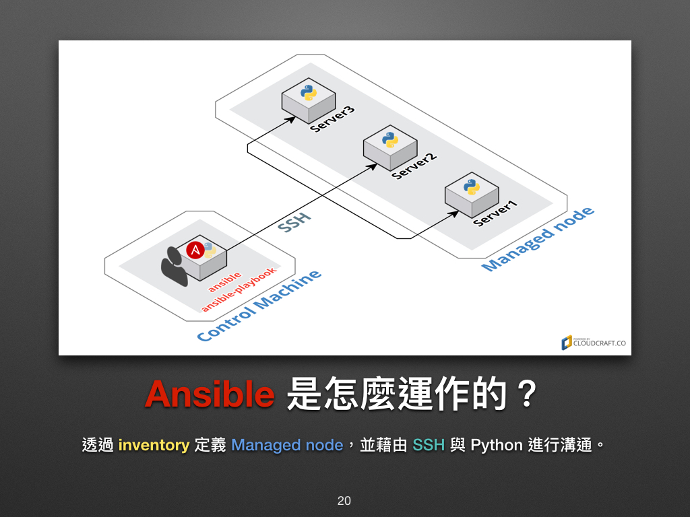

# 【运维自动化】Ansible 学习指南

推荐阅读:

- [Ansible 自动化运维教程](https://www.w3cschool.cn/automate_with_ansible/)
- [Ansible 中文权威指南](https://ansible-tran.readthedocs.io/en/latest/)

## 简单介绍

IaC 工具, Infrastructure as Code, 基础设施即代码

- Ansible 是个与 Puppet, SaltStack, Chef 并驾齐驱的组态设定 (Infrastructure as Code) 工具，其简单易用的特性让人爱不释手，在 DevOps 界更佔有一席之地。
- Ansible 提供一种最简单的方式用于发布、管理和编排计算机系统的工具，你可在数分钟内搞定。
- Ansible 是一个模型驱动的配置管理器，支持多节点发布、远程任务执行。默认使用 SSH 进行远程连接。无需在被管理节点上安装附加软件，可使用各种编程语言进行扩展。



- 需要连上的机器预先安装了 Python, openssh-server

参考: [基础环境部署参考](https://www.w3cschool.cn/automate_with_ansible/automate_with_ansible-1khc27p1.html)

## 内容

### 设定 Ansible

#### ansible.cfg

`ansible.cfg` 文件是 Ansible 的配置文件，用于定义 Ansible 操作的全局设置和默认行为。Ansible 会按照特定的顺序查找这个文件，以确定使用哪个配置。查找顺序通常如下：

1. `ANSIBLE_CONFIG` 环境变量指定的路径（如果设置了的话）。
2. 当前目录中的 `ansible.cfg` 文件。
3. 用户主目录中的 `.ansible.cfg` 文件。
4. 全局 `/etc/ansible/ansible.cfg` 文件。

`ansible.cfg` 文件中可以配置许多重要的设置，包括但不限于：

- **默认的清单文件路径** (`inventory`)：指定了 Ansible 默认查找主机清单的位置。
- **远程用户** (`remote_user`)：设置默认的远程连接用户。
- **私钥文件** (`private_key_file`)：指定默认的 SSH 私钥文件。
- **主机键检查** (`host_key_checking`)：启用或禁用 SSH 时的主机键检查。
- **并行任务数** (`forks`)：定义了 Ansible 同时操作的最大主机数。
- **超时时间** (`timeout`)：设置网络连接超时时间。
- **远程端口** (`remote_port`)：指定 SSH 连接的默认端口。
- **模块路径** (`library`)：指定额外 Ansible 模块的路径。
- **角色路径** (`roles_path`)：定义角色查找的目录。
- **日志文件路径** (`log_path`)：指定 Ansible 的日志文件路径。
- **重试文件保存路径** (`retry_files_enabled` 和 `retry_files_save_path`)：设置是否保存失败的任务重试文件，以及其保存位置。

通过这些配置，你可以定制 Ansible 的工作方式，以符合你的具体需求或环境配置。例如，你可以指定一个特定的清单文件为默认选项，避免每次执行命令时都需要指定清单文件；或者你可以设置日志文件路径来收集 Ansible 运行时的详细日志，便于问题追踪和系统管理。

设置 `ansible.cfg`

```cfg
[defaults]
inventory = hosts.yml

# 默认远程用户
remote_user = admin

# SSH 私钥文件路径
private_key_file = ~/.ssh/id_rsa

# 关闭首次连接到主机时的SSH密钥验证
host_key_checking = False

# 禁用重试文件的创建
retry_files_enabled = False

# 同时操作的最大主机数
forks = 20

# 网络连接的超时时间（秒）
timeout = 30

# 指定SSH连接的默认端口
remote_port = 22

# 定义角色查找的目录
roles_path = /home/ec2-user/ansible

[privilege_escalation]
# 启用权限提升，默认使用sudo
become = True

# 权限提升的方法，这里使用sudo
become_method = sudo

# 权限提升后的用户，这里使用root
become_user = root

# 运行时不提示sudo密码
become_ask_pass = False

[persistent_connection]
# 控制使用持久连接时的连接超时时间
connect_timeout = 60

# 持久连接的重试次数
retries = 3
```

#### Inventory

inventory 就单字本身有详细目录、清单和列表的意思。在这里我们可以把它当成是一份主机列表，我们可通过它对定义每个 Managed Node 的代号、IP 位址、连线相关资讯和群组。

- **主要是定义 Managed node**主机地址和群组

#### 尝试

输入指令，查看是否输出结果: `ansible localhost -m command -a 'echo Hello World.' --ask-become-pass`

- `--ask-become-pass`: 提示输入密码
- `-K`: 提示输入密码

### Docker 管理容器

搭建测试容器: `docker pull chusiang/ansible-managed-node:ubuntu-14.04
`

- 运行: `docker run --name server1 -d -P xxx`

此时设置`ansible.cfg`:

```cfg
[defaults]

hostfile = hosts
remote_user = docker
host_key_checking = False
```

```ini
server1  ansible_ssh_host=127.0.0.1  ansible_ssh_port=32805 ansible_ssh_pass=docker

[local]
server1
```

尝试连接: `ansible server1 -m ping`
