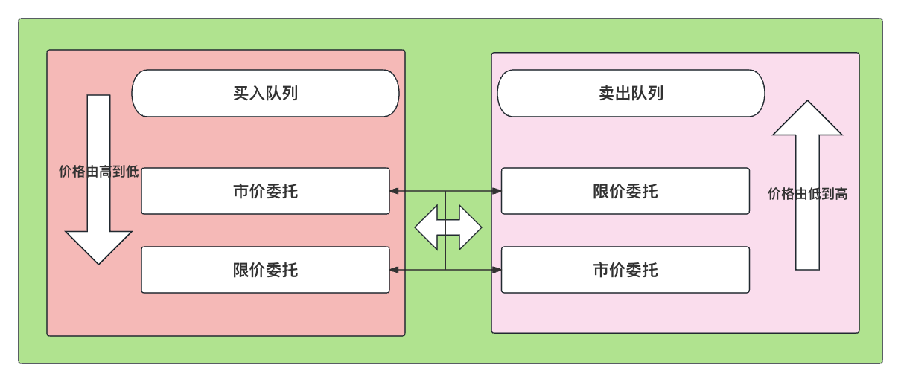
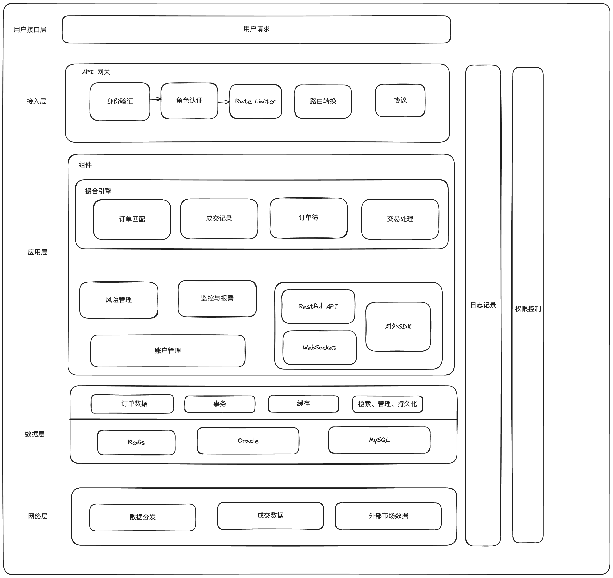
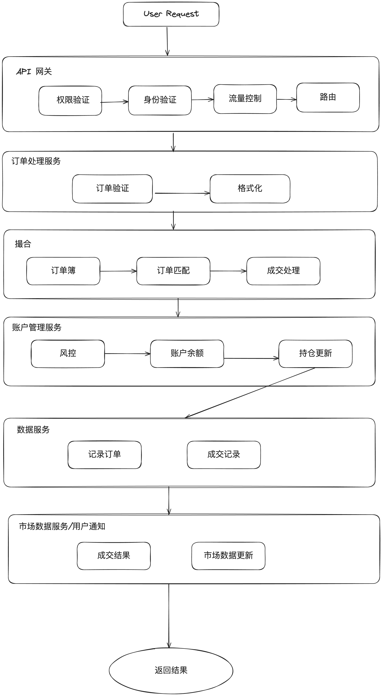

# 【系统设计】撮合引擎设计

## 介绍

### 高频交易(High-Frequency Trading, HFT)的专业术语介绍

#### 1. Co-location 主机托管

定义: HFT 公司或自营交易团队将自己的交易主机与交易所的主机放置在同一机房。

**特殊**: 在中国市场，Co-location 是指物理距离上尽可能近的机房。

优势:

- 通过减少信号传输时间，提高交易速度。
- 交易所需要向高频交易公司收取百万美金的“低延迟访问”特权费，Co-location 已经成为交易所丰厚盈利的来源之一。

但这并不是一个专为高频交易公司提供的服务，买方机构和数据供应商也经常通过主机托管寻求速度优势，比如 Bloomberg，Dealogic 和 Moody’s Analytics 等。

#### 2. Flash Trading 闪电交易(闪电指令)

交易所在向所有市场参与者发布交易信息前，会优先闪现**买进**或**卖出**订单的委托情况给高频交易机构，闪现的显示时间只有几分之一秒。

具体而言，当一个交易者提交一个订单后，它不是立即将未成交订单转移到另外一家交易所，而是在一个极短的时间内——通常是 30 到 500 毫秒(1 秒等于 1000 毫秒)，以“全国最佳买卖价”的价格，先在本交易所内“闪现”给其市场参与者(通常是高频交易商)。如果 30 到 500 毫秒的时间耗尽后该订单还未完成，才将该信息转移到其他交易所。换言之，闪电订单给高频交易商提供了抢先交易的机会。

闪电交易存在争议是因为 HFT 公司可以利用这些信息优势在其他投资者挂单之前进行交易，虽然这可能被解释为合法化的抢先交易（Front Running）。

#### 3. Low Latency 低延迟

指的是从信号发出到收到的时间。

更低的网络延迟意味着更快的交易速度，为了能尽快执行订单并在交易中获取竞争优势，HFT 交易者为此斥巨资来获得更快的计算机硬件、软件和网络传输速度。

延迟的最大决定因素是距离，即信号从一个点传输到另一个点，所需要通过的光缆的物理距离（通常是光纤）长度。

两点之间直线最短，谁的光纤最直，谁的物理距离最短，谁的距离就最快。

但即使是通过最短的距离架设的光缆，也无法保证最低的延迟，因为由于物理原因，光信号在光纤中传播的速度并不能达到光速，从物理距离上来说，没有比 Co-location 更近的了。

因此使用 Co-location 的高频交易公司的延迟时间要小得多，因而交易优势远远超过服务器位于数英里之外的竞争对手公司。

#### 4. Liquidity Rebates 流动性佣金返还

大多数交易所采用“做市商模式”来提供股票流动性。

在这种模式中，投资者和交易者以执行限价订单的形式从交易所获得小额的佣金返还，无论买单或卖单，只要交易成功，交易所即向该流动性的提供商支付佣金返还。

因为他们被认为有助于股票的流动性，即他们是流动性的“制造者”。

虽然返还的佣金通常是每股 1 美分，甚至更少，但每天交易数百万股，也可以累计非常可观的返还收益。因此越来越多的以专门获取佣金返还为赢利目的的交易策略便应运而生了。

#### 5. Matching Engine 撮合引擎

交易所交易系统的核心，用来匹配买卖订单。电子化交易前，是由交易大厅的工作人员负责执行。

由于撮合引擎需要匹配证券市场的所有买家、卖家的委托订单，因此撮合引擎的稳定运转对于确保交易所的正常运作至关重要。撮合引擎在交易所的机房里，为了能够更快地把订单传输到交易所进行撮合，HFT 公司会尽可能地把自己的主机靠近交易所的数据中心。

#### 6. Pinging 试单

指的是以小额的(通常是一两百股)、不断提价的(例如每次增加一分钱)、不能立即成交便立即撤销的订单(Immediate-or-Cancel Order，简称 IOC 订单)的策略，以便窥探到暗池或交易所的大额隐藏订单。

你可以把 Pinging 想象成类似于一艘船或潜艇发出声纳信号来探测即将到来的障碍物或敌方船只。在 HFT 环境中，Pinging 被用来寻找隐藏的“猎物”。

为了发现大订单的存在，高频交易公司对每只上市股票进行 100 股的出价和报价。

一旦高频交易者发现存在大单，就抢先交易，扫单之后（即吃掉已有的流动性）再以稍差后的价格（更高或更低的价格）提供“新的流动性”，向机构投资者反向买卖，从中牟利。

Pinging 被一些有影响力的市场参与者比作“诱饵”，因为它的目的就是吸引有大量订单的机构暴露出他们的计划。

#### 7. Point of Presence 接入点

交易者连接交易所交易系统的接入点。

无论是听取行情、报单交易，为了减少网络延迟，HFT 公司的目标是尽可能地把服务器接近交易所。请参阅“Co-location”。

#### 8. Predatory Trading 猎物算法交易

也有翻译为捕食交易，掠夺者交易。

一些 HFT 公司通过人为制造的价格来诱使机构投资者提高买入价格或降低卖出价格，从而锁定交易利润。

举个栗子：

假设机构投资者的心理成交价格在 30 ～ 30.05 美元之间。猎物算法交易商用 Pinging 来寻找其他投资者潜在的连续算法订单。

在计算机确认价格为 30 美元的算法报单的存在后；

猎物算法交易程序即发起攻击：报出价格为 30.01 美元的买单，从而迫使机构投资者迅速将后续买单价格调高至 30.01 美元；

然后，猎物算法交易商进一步将价格推高至 30.02 美元，诱使机构投资者继续追逐。

以此类推，猎物算法交易商在瞬间将价格推至机构投资者所能接受的价格上限 30.05 美元，并在此价格将股票卖给该机构投资者。

猎物算法交易商知道 30.05 美元的人为价格一般难以维持，从而在价格降低时进行补仓赚取利润。

#### 9. Securities Information Processor 证券信息处理器

该技术用于收集来自不同交易所的报价和交易数据，整理和整合该数据，并不断传输所有股票的实时报价和交易数据。

SIP 计算所有股票的全国最佳买入价和卖出价（NBBO，National Best Bid Offer），但由于数据量庞大，收集、汇总来自不同交易所的股价数据需要好几毫秒，而传送又得花费好几毫秒，而这几毫秒的延迟就可以帮助高频交易员预先了解到市场并从中获利。

SIP 协议没有规定不允许高频交易员在交易所内设置电脑以更快地计算出自己的股价数据，他们也正是这样做的，所以，高频交易团队以更强的计算机系统性能以及 Co-location 的优势让他们比普通投资者早了解到市场的走势。

#### 10. Smart Routers 智能路由

是一种利用复杂的算法将大订单拆分成小订单发给不同交易所的技术。

下单时，智能订单路由（SOR）技术能够通过交易算法将大量订单拆分后，先指向暗池（Dark Pool）再指向交易所，为交易者提供最佳的订单执行机会。

由于不同经纪商的智能路由策略的存在，机构投资者的大单通常要发给多个交易所。但是，发往各个交易所的所需时间不同，这其中轻微的延迟就给了具备技术手段的 HFT 探测其他市场参与者交易意图的机会。

### 常见高频交易策略

#### 1. 做市类策略

在盘口挂限价单进行双边交易以提供流动性来获取利润的交易策略。策略的收入包括买卖价差和交易所提供的佣金返还（获得交易所做市商资格有更多的优惠和合规豁免）两部分。

#### 2. 信息优势策略

基于行情数据信息优势的低延迟套利；基于跨市场行情和速度优势，进行投机和套利；例如：现在的国内部分机构收取国外行情数据，在部分区间线路利用微波传输，比其他机构的数据快，这类跨市场策略利润几乎被这些机构所瓜分。

#### 3. 微观结构策略

主要是通过分析市场中短期的订单属性、盘口数据、交易数据，根据短时间内买卖力量的不平衡进行超短交易的策略。通过建模分析报价和交易量等市场数据，提前分析出一些尚未被交易者识别出来的消息，进而获利。既有短期趋势，也有回归策略。

#### 4. 方向性类策略

就是利用 tick 数据和盘口委托数据预测短期的价格波动走势，包括趋势和回归策略，理论上与中低频的方向性策略原理一致；主要有多因子预测、事件/新闻驱动交易策略。其中事件/新闻驱动策略，就是利用事件或新闻在极短时间内的对价格的影响来赚取利润的交易策略。

#### 5. 统计套利类策略

寻找具有相关性的资产，发掘暂时性的、可预测的统计偏离或定价错误，进行套利的一种交易策略。主要策略有跨期、跨品种、跨市场套利、期现货套利、ETF 申赎者溢价套利；配对交易。

## 撮合引擎核心功能设计

### 组件

我们可以分为 2 块:

- 核心组件
- 辅助组件

#### 核心组件

- **订单簿(Order Book)**：存储当前所有未成交的买、卖订单。通常需要两个订单簿，分别用于买单和卖单。
- **撮合引擎(Matching Engine)**：核心算法，负责根据预定的规则匹配买卖订单。
- **交易处理器(Trade Processor)**：处理成交后的订单，包括更新订单簿、生成交易记录等。
- **数据分发器(Data Distributor)**：将订单、成交等信息实时分发给客户端。

#### 辅助组件

- **风险管理系统(Risk Management System)**：监控交易行为，防止欺诈和操纵市场。
- **监控与报警系统(Monitoring and Alerting System)**：实时监控系统状态，及时发现并解决问题。
- **API 网关(API Gateway)**：提供 RESTful API 或 WebSocket 接口，供用户提交订单和查询市场数据。
- **账户管理服务(Account Management Service)**：管理用户的账户信息，包括资金、持仓等。

### 组件介绍

#### 订单簿（Order Book）

- **功能**：记录当前所有未成交的买、卖订单，按照价格和时间优先级排序。
- **实现细节**：
  - **数据结构**：通常使用有序队列或树状结构，以支持快速的插入、删除和查找操作。
  - **订单状态**：订单簿需要记录订单的状态（如待成交、部分成交、已撤销等）。
  - **快照**：为了提供实时的市场数据，订单簿需要支持快照功能，以便向用户展示当前的市场状态。

#### 撮合引擎（Matching Engine）

- **功能**：撮合引擎是整个交易系统的心脏，负责接收买卖订单，并根据预定规则（如价格优先、时间优先）进行匹配，以完成交易。撮合过程需要极高的效率和准确性，以保证市场的公平和流畅。
- **实现细节**：
  - **订单簿（Order Book）管理**：撮合引擎内部管理一个或多个订单簿，每个订单簿对应一个交易品种。订单簿记录了待成交的买卖订单，按照价格和时间优先级排序。
  - **匹配算法**：当新订单进入系统时，撮合引擎会尝试与订单簿中现有的订单进行匹配。匹配成功的订单将执行成交，更新订单簿状态，并生成成交记录。
  - **并发处理**：为了处理高频交易，撮合引擎可能采用多线程或事件驱动模型，实现高效的并发处理能力。

#### 交易处理器（Trade Processor）

- **功能**：处理成交后的订单，包括更新订单簿、生成成交记录等。
- **实现细节**：
  - **订单更新**：一旦订单成交，交易处理器需要更新订单簿的状态，包括删除已成交的订单，更新部分成交的订单等。
  - **成交记录**：生成成交记录，包括成交价格、成交数量、成交时间等信息。
  - **通知用户**：通知买卖双方订单的成交情况，以及更新用户的账户信息。

#### 数据分发器（Data Distributor）

- **功能**：将订单、成交等信息实时分发给客户端。
- **实现细节**：
  - **实时推送**：使用 WebSocket 或者轮询机制向用户推送实时订单匹配结果和市场数据。
  - **数据快照**：提供市场深度（order book）的快照，帮助参与者了解当前市场状态。
  - **历史数据查询**：允许用户查询历史成交记录，以便分析和决策。

#### 风险管理系统 (Risk Management System)

- **功能**：监控交易行为，识别并防范操纵市场、欺诈等风险行为。
- **实现细节**：
  - **交易监控**：实时分析交易数据，寻找异常模式和潜在的风险行为。
  - **预警系统**：一旦检测到潜在风险，系统将触发预警，采取相应的风险控制措施。
  - **风险报告**：定期生成风险报告，帮助管理层了解系统的风险状况。

#### 监控与报警系统 (Monitoring and Alerting System)

- **功能**：实时监控系统状态，及时发现并解决问题。
- **实现细节**：
  - **系统监控**：监控系统的性能、稳定性和可用性，及时发现系统故障和性能问题。
  - **报警机制**：一旦发现异常，系统将触发报警，通知相关人员进行处理。
  - **日志记录**：记录系统的运行日志，以便分析和故障排查。

#### API 网关 (API Gateway)

- **功能**：提供一个统一的接口层，供外部客户端访问系统服务，如提交订单、查询市场数据等。
- **实现细节**：
  - **接口管理**：管理多种 API 接口（如 RESTful API、WebSocket），确保接口的稳定和安全。
  - **流量控制**：实现流量控制和认证机制，保护系统免受恶意访问和攻击。
  - **日志记录**：记录 API 的访问日志，以便分析和监控系统的使用情况。

#### 账户管理服务 (Account Management Service)

- **功能**：管理用户的账户信息，包括资金、持仓等。
- **实现细节**：
  - **账户查询**：提供用户账户的查询接口，包括资金余额、持仓信息等。
  - **资金清算**：处理用户的资金存取、转账等操作，保证账户的资金安全。
  - **风险控制**：实施风险控制策略，防止用户的恶意操作和风险行为。

### 匹配

#### 触发条件

匹配买卖订单。当买单的价格等于或高于卖单价格时，撮合引擎执行交易。

#### 订单类型

1. 限价单: 买单的价格通常低于当前市价，卖单的价格通常高于当前市价
2. 市价单: 以当前市场上可用的最佳价格执行交易

#### 价格优先、时间优先规则

- **价格优先原则**：对于买单，价格最高的最先匹配；对于卖单，价格最低的最先匹配。
- **时间优先原则**：在价格相同的情况下，先提交的订单优先匹配。
- **数量优先**：在价格和时间相同的情况下，数量大的订单可以获得优先权。这个不太常见，因为可能会影响小额交易者的利益。

#### 订单匹配流程

1. 接收新订单，并根据其类型（买/卖）将其加入相应的订单簿。
   1. 记录所有待匹配的买卖订单，**买单按价格降序排列，卖单按价格升序排列**
   2. 匹配过程中，直接找队列头部的对手订单是不是能匹配。能匹配就匹配，不能匹配看订单类型，time in force，如果市场价，ioc，fok 之类的撤单，否则加入订单簿。**已经按照顺序排好了，都在头部，直接找头部的订单，不需要遍历**
   3. 匹配的数据结构使用**红黑树**，支持查找、插入、删除更加高效。
2. 尝试根据价格优先、时间优先原则找到匹配的订单。
   1. 对于市价单，选择订单簿中的最佳可用价格。
   2. 对于限价单，查找能满足设定价格条件的对手方订单。
3. 根据买卖双方订单的数量进行匹配。如果找到匹配，根据订单的数量进行成交处理。如果一个订单的数量大于对手方订单，剩余部分继续在订单簿中等待匹配。
   1. 交易执行：一旦找到匹配，交易执行。买卖双方的账户相应更新，订单簿也进行更新。
   2. 部分成交：如果一个订单只有部分能够匹配，它可能部分成交，剩余部分继续待在订单簿。
   3. 一旦撮合成功，交易被执行。此过程包括更新订单簿和通知买卖双方。
4. 更新订单簿，移除或更新已成交或部分成交的订单。
5. 生成成交记录，通知交易双方。

## 查询策略

查询策略涉及到订单数据的查询和展示，以及如何实时反馈给市场参与者。包括：

1. **实时数据推送**：使用 WebSocket 或者轮询机制向用户推送实时订单匹配结果和市场数据。
2. **数据快照**：提供市场深度（order book）的快照，帮助参与者了解当前市场状态。
3. **历史数据查询**：允许用户查询历史成交记录，以便分析和决策。

## 性能优化

### 撮合策略的问题

1. 高延迟，尤其在面向高频交易的场景下，高延迟会导致交易成本的增加。
2. 同步问题:
   1. 交易顺序: 需要同步处理，以确保交易的顺序性和一致性，但是交易量巨大，同步处理可能导致处理瓶颈，影响系统的响应时间
   2. 资产余额更新：精确性和一致性，避免由于并发导致的余额不一致问题，高频更新操作可能导致数据库的瓶颈
   3. 订单状态通知采用异步，在高流量情况下，消息队列或推送服务有性能瓶颈
3. 撮合算法需要考虑优化流动性、减少市场冲击的撮合算法

### 优化策略

优化策略旨在提高撮合引擎的性能和效率，以处理高频交易和大量订单。常见的优化策略包括：

1. **并发处理**：通过并行处理多个订单，提高撮合速度。

   1. **并发锁策略**：
      1. 实现细粒度锁或无锁设计，减少锁竞争，提高并发处理能力。
      2. 利用现代 CPU 的多核特性，采用多线程或事件驱动模型处理并发请求。

2. **索引优化**：使用高效的数据结构（如红黑树、跳表等）来存储订单，优化查询和更新操作的速度。
3. **内存计算**：将频繁访问的数据存储在内存中，减少磁盘 I/O，加快数据访问速度。

## 技术选型示例

- **编程语言**：C++（用于撮合引擎核心算法，因其执行效率高）；Python 或 Java（用于 API 服务层，因其开发效率高）。

- **数据存储**：使用 Redis 作为订单簿的存储，因其提供高性能的内存数据访问；使用 PostgreSQL 或其他关系数据库管理系统存储持久化数据，如用户信息、成交记录等。
- **通信协议**：WebSocket（用于实时数据推送）；RESTful API（用于订单提交和查询等操作）。

## 架构

采用微服务架构:

- **撮合服务**：核心服务，负责订单的匹配逻辑。
- **订单管理服务**：处理订单的生命周期，包括订单的接收、验证和状态更新。
- **市场数据服务**：提供市场数据的聚合和分发，如实时行情、订单簿快照等。
- **账户服务**：管理用户账户和资产，处理资金的清算和结算。
- **风险控制服务**：监控交易行为，实施风险管理策略。

### 分层架构设计 (Layered Architecture)

采用分层架构设计，以提高系统的模块化、可维护性和可扩展性。主要可以分为以下几个层次：

1. 接入层：负责处理用户请求的接入，如订单提交、查询等，以及对外部请求的认证和授权。
2. 应用层：实现撮合引擎的业务逻辑，包括订单的匹配、成交记录的生成等。
3. 数据层：负责订单数据的存储、检索和管理，以及成交数据的持久化。
4. 网络层：负责内部服务间的通信以及与外部系统的数据交换。

### 链路架构设计 (Service Mesh Architecture)

描述数据从接收到处理再到响应的整个流程：

1. 订单接收：用户通过 API 网关提交订单，订单数据首先被接入层处理。
2. 订单验证：应用层对订单进行合法性验证，包括用户身份验证、订单参数校验等。
3. 订单匹配：合法的订单进入撮合池，根据预定规则（价格优先、时间优先）与其他订单进行匹配。
4. 成交处理：匹配成功的订单生成成交记录，更新双方的账户余额和持仓信息。
5. 数据持久化：将订单和成交记录持久化存储到数据层，保证数据的一致性和可靠性。
6. 通知反馈：通过网络层将成交结果反馈给相关用户，同时更新市场数据服务。

### 组件架构图 (Component Architecture)

展示系统内部各个组件的功能和相互关系：

1. API 网关：作为系统对外的唯一入口，负责请求的接收、路由和负载均衡。
2. 订单处理服务：负责订单的初步处理，包括验证、格式化和路由。
3. 撮合核心：系统的核心组件，实现订单匹配的逻辑。
4. 账户管理服务：管理用户账户信息，处理资金和持仓的更新。
5. 数据服务：负责订单和成交数据的存储、查询和管理。
6. 风险控制服务：监控交易行为，执行风险管理策略。
7. 市场数据服务：提供市场行情数据，包括实时的订单簿快照、成交记录等。

## 附加信息

在交易市场中，订单可以根据它们对市场流动性的影响被分类为“maker”订单或“taker”订单。这两种类型的订单共同决定了市场的流动性和交易深度。

- taker 订单对于那些寻求立即成交的交易者来说是必要的，尽管它们需要支付更高的交易费用。
- maker 订单则对于那些愿意等待更优价格成交的交易者更为有利，同时为市场提供了必要的流动性。

### Taker 订单

- **定义**：Taker 订单是指那些立即按照市场上现有的最佳价格成交的订单。这类订单“取走”了市场上现有的流动性，因为它们立即与市场上已存在的订单（maker 订单）匹配成交，而不是添加到订单簿中等待其他人来匹配。
- **特点**：Taker 订单通常是市场参与者急于买入或卖出某种资产时所使用的订单类型。它们通过立即与订单簿上现有的对手方订单进行匹配来执行，从而“取走”了市场的流动性。
- **费用**：因为 taker 订单为了快速成交牺牲了流动性，所以交易所通常对此类订单收取较高的手续费，相比于为市场提供流动性的 maker 订单。

### 与 Maker 订单的对比

- **Maker 订单**：是指那些被添加到订单簿中，为市场提供流动性的订单。这些订单不会立即成交，而是等待与之匹配的对手方订单出现。Maker 订单“制造”了市场流动性，因为它们增加了市场的可交易深度和宽度。
- **费用差异**：为了鼓励市场参与者提供流动性，交易所通常会对 maker 订单提供较低的手续费，甚至有时会给予手续费返还作为奖励。
