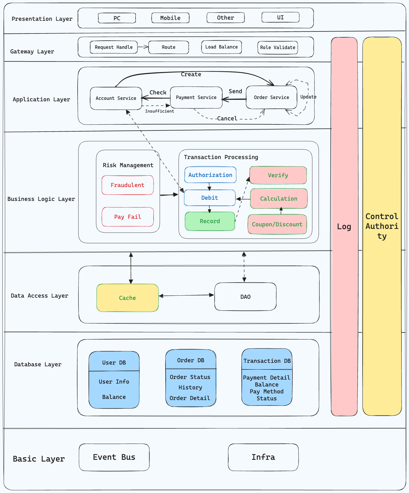
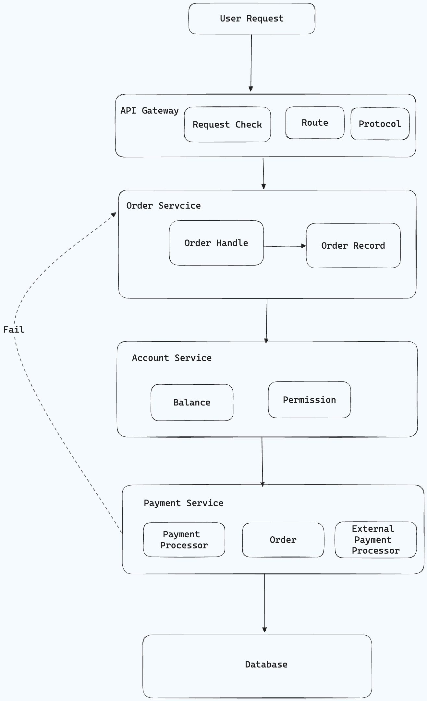
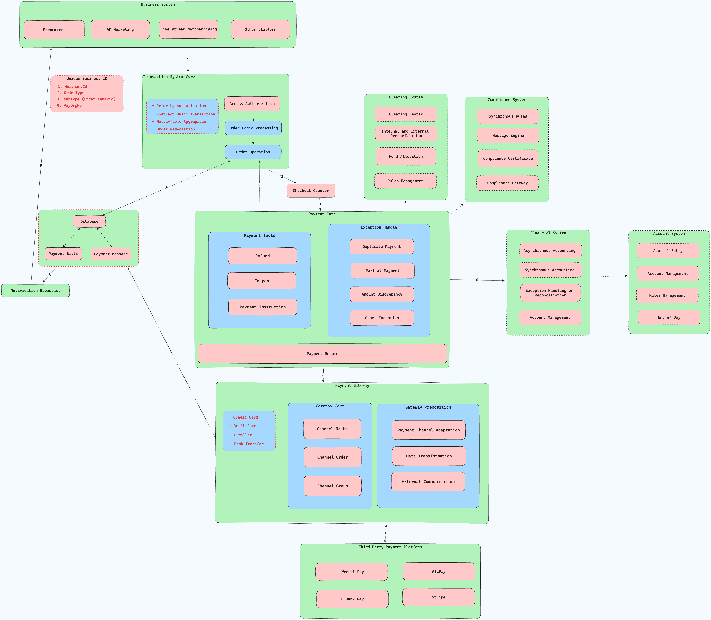

# 【系统设计】咖啡购买-支付平台系统设计

## 简单支付设计

问题：现在要做一个系统设计，系统主要是支付平台。当我想要下单去购买一个咖啡，如何设计系统，考虑账户的余额检测，下单，如果下单错误的回滚等。

如果要设计一个支付平台系统，特别是处理购买流程（如购买咖啡）时，需要考虑多个关键组件和流程，确保交易的顺畅、安全和准确。

以下是一个概括性的系统设计概念，包括账户余额检测、下单流程以及错误处理和回滚机制。

### 设计概念

#### 1. **主要组件**

- **用户界面（UI）**：允许用户选择商品（如咖啡）、查看价格并进行购买。
- **订单系统**：处理订单的创建、更新和取消。
- **支付处理器**：处理支付授权、清算和回滚。
- **账户服务**：管理用户账户信息，包括余额检查和更新。
- **数据库**：存储用户信息、订单详情、商品信息和交易记录。
- **消息队列（可选）**：用于解耦各个服务，提高系统的扩展性和可靠性。

#### 2. **主要流程**

##### a. 下单流程

1. **用户选择商品**：通过 UI 选择购买的咖啡，并点击购买。
2. **创建订单**：系统生成一个新的订单，状态为“待支付”。
3. **检查余额**：账户服务检查用户的账户余额是否足够支付订单。
   - 如果余额不足，通知用户并取消订单。
   - 如果余额足够，继续支付流程。
4. **支付授权**：支付处理器尝试冻结订单金额。
   - 如果授权成功，继续。
   - 如果授权失败（如银行拒绝），取消订单并通知用户。
5. **更新订单状态**：订单状态更新为“支付成功”。
6. **扣款**：从用户账户扣除订单金额。
7. **完成交易**：更新数据库记录，包括订单状态和用户余额。

##### b. 错误处理和回滚

- 在任何步骤发生错误时（如支付授权失败、数据库更新失败等），系统需要采取回滚操作以保证数据一致性。
- 回滚操作可能包括：
  - **取消订单**：将订单状态更新为“已取消”。
  - **退款**：如果已扣款，则通过支付处理器退款至用户账户。
  - **日志记录**：记录错误和回滚操作，以便后续分析和改进。

#### 3. **系统考虑**

- **事务性**：确保支付流程的每个步骤都能完整执行或在失败时完全回滚，保持数据一致性。
- **可靠性和可用性**：设计高可用架构，处理高并发请求，确保系统稳定运行。
- **安全性**：采取加密、安全认证和授权措施保护用户数据和交易安全。
- **监控和日志**：实施监控系统和日志记录，以便实时监控系统状态和快速定位问题。

### 分层架构

分层架构将系统划分为几个逻辑层次，每个层次有其独特的职责。对于支付平台，常见的分层包括：

1. 表现层（Presentation Layer）：用户界面（UI），提供用户交互。
2. 网关层（Gateway Layer）：处理用户请求，路由到不同的服务。作为前端与后端服务之间的接口，处理请求路由、负载均衡和身份验证。
3. 应用层（Application Layer）：处理用户的请求，执行业务逻辑，如创建订单、支付流程等。
   1. 订单服务(Order Service)：处理订单的创建、查询和状态更新。
   2. 支付服务(Payment Service)：负责支付流程的管理，包括支付请求的发送和支付状态的更新。
   3. 账户服务(Account Service)：管理用户账户信息，包括余额查询和更新。
4. 业务逻辑层（Business Logic Layer）：包含核心业务逻辑，如账户余额检查、订单状态管理等。
   1. 交易处理(Transaction Processing)：处理支付流程，包括支付授权、扣款和交易记录更新。核心业务逻辑，包括验证交易的合法性、计算需要的支付金额、处理优惠和折扣等。
   2. 风险管理(Risk Management)：检测和处理潜在的风险，如欺诈交易、支付失败等。
5. 数据访问层（Data Access Layer）：与数据库交互，处理数据的存取。
   1. 数据库访问对象（DAO）：提供访问数据库的 API，隐藏数据库的具体实现。
   2. 缓存机制：提高数据读取速度，减轻数据库负担。
6. 数据库层（Database Layer）：存储用户信息、订单信息、支付记录等数据。
   1. 用户数据库：存储用户的注册信息、账户余额等。
   2. 订单数据库：存储订单详情、状态和历史记录。
   3. 交易数据库：记录每笔支付的详情，包括金额、支付方式和状态。

### 链路架构

链路架构图展示了用户进行一次购买操作时，请求在系统中流转的路径。这包括用户操作、系统内部服务的调用，以及最后的数据存储。对于购买咖啡的操作，链路如下：

1. 用户操作
   1. 用户通过用户界面下单购买咖啡。
2. 应用层
   1. 订单系统接收请求，创建订单，并请求账户服务检查用户余额
   2. 通过 API 网关发送到后端的订单服务
3. 订单服务处理
   1. 账户服务确认余额足够后，请求支付处理器冻结金额并进行支付。
   2. 订单服务接收请求，创建新的订单记录，并请求账户服务检查用户的余额
4. 账户服务验证
   1. 支付处理器处理支付，并将结果返回给订单系统。
   2. 账户服务验证余额是否充足。如果足够，发送支付请求到支付服务
5. 支付服务与支付处理器交互
   1. 订单系统根据支付结果更新订单状态，并将订单和支付信息存储到数据库中。
   2. 支付服务请求第三方支付处理器或银行接口完成支付授权和扣款
6. 支付结果处理
   1. 在整个过程中，各服务通过日志服务记录操作，便于监控和故障排查。
   2. 支付服务根据支付处理器的响应更新订单状态。成功则确认订单，失败则触发回滚
7. 数据持久化
   1. 订单和交易的详情被存储到相应的数据库中

## 深入设计

支付系统是具有交易属性公司的核心领域。上面的简单设计，仅仅是一个基础的“交易流程”。而在实际的支付系统中，还有许多其他的功能和特性需要考虑。而整体归类可以分为 2 个大的方向：

1. **交易系统**：包括交易的创建、支付、退款、回滚等，关联了业务场景和底层支付处理器的交互。
2. **支付系统**：包括支付处理器、账户服务、风险管理、监控等，尤其是调用支付工具刀对账清算等一系列的操作。

### 核心系统交互

