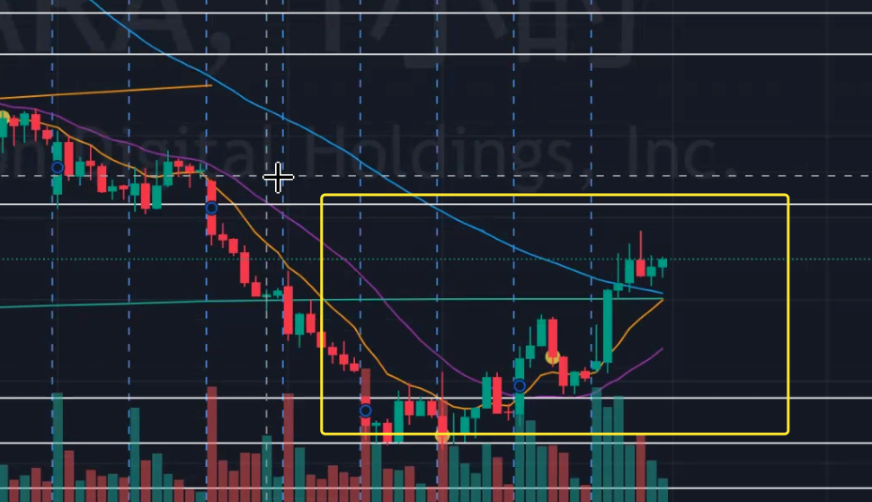

# Stock Trading Learning

## Brief

1 涨跌底层理念
2 趋势
3 指标
4 形态 pattern

## 基础概念

1. 股票跌是因为卖家比买的多
2. 如何看涨、看空？
   1. Order Book: 
   2. 100 股会改变一次价格：
   3. 具体变化就会反映到 K 线上： 
      1. 价格的 K 棒是连续的，且相互之间是存在关联的。最好是以日割线为单位，这样可以更好的看到价格的变化。
3. 趋势: 
   1. 波浪形前进的东西，就是趋势。趋势是由一系列的波浪组成的。和时间周期有关。
   2. 趋势的类型
      1. 上升趋势
      2. 下降趋势
      3. 横向趋势
   3. Lower High, Higher Low
      1. 
   4. Higher High, Higher Low
      1. 
   5. 这条线为走出趋势：
4. 趋势线
   1. 下降的时候，连接它的高点，就是下降趋势线
   2. 上升的时候，连接它的低点，就是上升趋势线
   3. 
   4. 在画趋势线的时候，要尽量的连接更多的点，这样才能更好的反映出趋势的走势。
   5. 识别趋势线的区间：
   6. 选择的交易要擅长的领域, 在交易的时候，**选择自己的时间周期**，这样才能更好的把握市场的走势。
      1. 在 LH 的时候买或者卖，
5. 什么叫做顶部和底部
   1. 顶部和底部是相对的，是相对于前面的走势来说的。
   2. 顶部和底部的形态是有很多种的，不同的形态代表着不同的意义。
   3. 由 3 根 K 线组成的形态，叫做三重顶和三重底。 
6. 辅助线均线
   1. 均现有两种 MA 和 EMA
      1. MA 是简单的均线，是对一段时间内的价格进行平均值的计算。
      2. EMA 是指数移动平均线，是对一段时间内的价格进行加权平均值的计算。
      3. 
      4. 均线往上走，代表着价格的上涨，均线往下走，代表着价格的下跌。**均线是最重要的**
      5. 均线交叉，代表着价格的变化，是买入和卖出的信号。比如,
         1. MA5 和 MA10 交叉，MA5 上穿 MA10，代表着价格的上涨，是买入的信号。
         2. MA5 和 MA10 交叉，MA5 下穿 MA10，代表着价格的下跌，是卖出的信号。
         3. 例子图
         4. 均现是成本的，是对价格的一个平均值的计算，是对价格的一个平滑的计算。
         5. 中长期的不同：，
            1. MA5 和 MA10 代表着短期的均线，MA20 和 MA60 代表着中期的均线，MA120 和 MA250 代表着长期的均线。
         6. 均现的弹性：
            1. 向上的均线有浮动的空间，向下的均线没有浮动的空间。
      6. 在行情明确的时候，均线是很好的参考指标，可以帮助我们更好的把握市场的走势。
      7. 短期均线在长期均线的上方，代表着价格的上涨，是买入的信号。可能会有回调，但是不会影响价格的上涨。买入的最好是在回调的时候：
      8. 指标存在风险，不是绝对的，只是参考。
7. 标准形态
   1. 形态是对价格的一个总结，是对价格的一个概括。英语叫做 pattern。
   2. 双底和双顶。双底和双顶是由两个底部和两个顶部组成的。
      1. 双底是一个底部的形态，双顶是一个顶部的形态。
      2. 双顶和双底是一个反转的形态，是一个反转的信号。
      3. 日内交易经常会出现双底和双顶的形态，是一个很好的交易信号。
   3. 小范围来回上下走动，是一个盘整的形态，是一个横向的形态。这种术语叫 consolidation。
      1. 什么是 consolidation？ 它是一个价格在一个范围内来回震荡的一个形态。
      2. 
      3. 在盘整的时候，价格会在一个范围内来回的震荡，这个时候是不适合交易的。
      4. 在盘整的时候，价格会在一个范围内来回的震荡，这个时候是不适合交易的。
      5. 这里的盈亏比是非常高的，寻找一个双底的机会，是一个很好的交易机会。
      6. 会把均线拉平，这个时候会有一个突破的机会，这个时候是一个很好的交易机会。
8. 支撑和阻力 
   1. 支撑和阻力是一个价格的一个阻挡的一个概念。
      1. 支撑是在跌的时候，价格会转为涨，这个时候是支撑。
      2. 阻力是在涨的时候，价格会转为跌，这个时候是阻力。
9. 步骤： 确定趋势，确定均线的方向，是否有交叉，查看 pattern，画清楚支撑和阻力，确定买入点和卖出点。
   1. 支撑：
   2. 阻力：
   3. 反转和压力的变化：
   4. 判断时间由大到小，先看大的时间周期，再看小的时间周期。
   5. 三角形突破，会有一个方向的突破，这个时候是一个很好的交易机会。 ，交易机会：
   6. 看空和看多：
   7. 分钟级别的趋势线非常脆弱
10. 跌不是因为泡沫，是因为卖家比买家多
11. snowfake: 
    1. MA 趋于平滑了，另外就是又回归到支撑点了,如果盈亏在支撑点附近徘徊，有点像之前说的那个 consolidation 的来回震荡
12. 弹性就是指支撑点很给力吧，下降区间不会太多，支撑会撑起来
13. 形态和均线都是辅助，要有边界，不需要考虑顶和底。K 线是连续的
14. wedge pattern，
