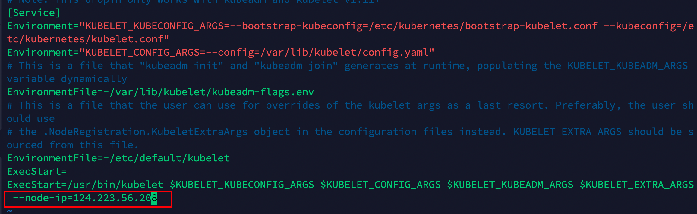

[TOC]

# 如何在公网上搭建 k8s 集群

> 本文主要参考 [多个公网服务器搭建 k8s 集群][5]，并结合自己的实际情况进行了一些修改。
>
> 1. kubeadmin 初始化集群
> 2. 公网搭建
> 3. 证书配置
> 4. 参考

> <strong style="color: red;">公网配置相对常见的子网配置会比较麻烦, 请注意：</strong>
>
> 1. 防火墙配置
> 2. 证书配置
> 3. 网络配置

## 集群配置

> **Master 节点的配置必须是 2 核 CPU 以上**, 此处以 Ubuntu 20.04 为例

现在的云服务器的公网 IP 是不会直接配置在服务器的网卡上的，网卡上的是内网 IP，而多个服务器的内网 IP 一定不会在同一个网段，所以配置公网服务器之间的 K8S 集群最大的问题就在于此，可以总结为：

1. master 主机 kubeadm init 时用内网 IP 还是公网 IP？
2. flannel 插件：pod 不互通，其实这个问题可能就是第一个问题没处理好造成的

### 1. 前置工作

#### 1.1 创建虚拟网卡

由于使用服务器公网 IP 启动 K8S 集群会出现问题。但目前服务器所在网段上没有这个 IP 的网卡，所以我们需要在对应网卡上创建一个对应公网 IP 的虚拟网卡。

持久化创建一个虚拟网卡，防止重启失效：

```bash
sudo vim /etc/network/interfaces
```

添加以下内容：

```bash
auto eth0:1
iface eth0:1 inet static
address <主网IP>
netmask 255.255.255.0
# 重启网卡
/etc/init.d/networking restart

# 查看是否创建成功
ifconfig
```

如果没有安装, 可以使用以下命令安装：

```bash
sudo apt install ifupdown ifupdown2 netscript-2.4
```

如果配置出现问题，查阅: [添加虚拟网卡][1-eth]

#### 1.2 安装前对每个主机的设置

```bash
# 关闭防火墙
systemctl stop firewalld
systemctl disable firewalld
ufw disable # ubuntu

# 关闭selinux
sed -i 's/enforcing/disabled/' /etc/selinux/config  # 永久
setenforce 0  # 临时

# 关闭swap
swapoff -a  # 临时
sed -ri 's/.*swap.*/#&/' /etc/fstab    # 永久

# 根据规划设置主机名
hostnamectl set-hostname <hostname>

# 在master添加hosts (换成自己的IP)
cat >> /etc/hosts << EOF
<公网IP1> master
<公网IP2> node1
<公网IP3> node2
EOF

cat <<EOF | sudo tee /etc/modules-load.d/k8s.conf
br_netfilter
EOF
# 将桥接的IPv4流量传递到iptables的链
cat > /etc/sysctl.d/k8s.conf << EOF
net.bridge.bridge-nf-call-ip6tables = 1
net.bridge.bridge-nf-call-iptables = 1
EOF
sysctl --system  # 生效

# 时间同步
yum install ntpdate -y
ntpdate time.windows.com
```

#### 1.3 安装必备软件

1. 安装 docker, 唯一要注意的是：选择的 CRI 容器进行时的 cgroups 管理器必须是 systemd，否则会提示失败,官网详细介绍：[配置 cgroup 驱动][1-cgroup]。 **官方推荐 kubelet 使用 systemd 驱动**，以此为例:

修改 `/etc/docker/daemon.json` 文件:

```bash
{
  "exec-opts": ["native.cgroupdriver=systemd"],
  "log-opts": {
    "max-size": "100m"
  },
  "log-driver": "json-file",
  "storage-driver": "overlay2",
  "insecure-registries": [ "https://<ip><:port>" ] # 如果要选择的镜像仓库是私有的，需要添加
  "registry-mirrors": ["https://<ip><:port>"] # 镜像加速
}
```

- registry-mirrors：镜像加速。
- cgroupdriver：使用 systemd。
- log-driver：使用 json 日志，大小为 100m。

配置 docker 认证的证书:

```bash
mkdir -p /etc/docker/certs.d/<ip>:<port>
cp ca.crt /etc/docker/certs.d/<ip>:<port>/ca.crt
```

此处的 ca.crt 是镜像仓库的证书，需要提前准备好。

- ca.crt: 证书文件
- <ip>:<port>: 镜像仓库地址

启动:

```bash
sudo systemctl enable docker
sudo systemctl daemon-reload
sudo systemctl restart docker
systemctl status docker # 确保是running状态
```

确认 Cgroup Driver 为 systemd:

```bash
docker info | grep "Cgroup Driver"
Cgroup Driver: systemd
```

1. 下载 k8s 安装工具

如果使用 aliyun, 配置 yum 源:

```bash
cat > /etc/yum.repos.d/kubernetes.repo << EOF
[kubernetes]
name=Kubernetes
baseurl=https://mirrors.aliyun.com/kubernetes/yum/repos/kubernetes-el7-x86_64
enabled=1
gpgcheck=0
repo_gpgcheck=0
gpgkey=https://mirrors.aliyun.com/kubernetes/yum/doc/yum-key.gpg https://mirrors.aliyun.com/kubernetes/yum/doc/rpm-package-key.gpg
EOF

yum makecache # 更新yum
```

安装 kubeadm, kubelet, kubectl:

```bash
sudo yum install -y kubelet-1.23.6 kubeadm-1.23.6 kubectl-1.23.6 --disableexcludes=kubernetes

systemctl enable kubelet # 开机启动
systemctl start kubelet # 启动kubelet
```

或者

```bash
apt-get install -y kubectl=1.23.0-00 kubeadm=1.23.0-00 kubelet=1.23.0-00
apt-mark hold kubelet kubeadm kubectl  # 锁定版本
```

#### 1.4 开启云服务器的端口

**ControlPanel/Master**:
| 协议 | 方向 | 端口范围 | 目标 | 使用者 |
| --- | --- | --- | --- | --- |
| TCP | 入站 | 6443 | kubernetes API 服务器 | 所有 |
| TCP | 入站 | 2379-2380 | etcd 服务器客户端 API | kube-apiserver, etcd |
| TCP | 入站 | 10250 | Kubelet API | Self, Control plane |
| TCP | 入站 | 10251 | kube-scheduler | Self |
| TCP | 入站 | 10255 | Read-Only Kubelet API | Self |
| TCP | 入站 | 10256 | Read-Write Kubelet API | Self |
| TCP | 入站 | 10257 | kube-controller-manager | Self |
| TCP | 入站 | 10259 | kube-scheduler | Self |

如果要在外部自己托管 etcd，还需要开启 2379-2380 端口。

**Worker**:
| 协议 | 方向 | 端口范围 | 目标 | 使用者 |
| --- | --- | --- | --- | --- |
| TCP | 入站 | 10250 | Kubelet API | Self, Control plane |
| TCP | 入站 | 30000-32767 | NodePort Services | All |

[服务 Service][1-service]: 是 pod 服务的默认端口范围。这里如果希望 Master 的 IP 也可以访问 Pod 服务，那么也可以给 Master 主机开放这些端口（建议）

**所有节点**:

- Flannel 网络组件构建 Pod 之间的通信时需要的配置

| 协议 | 方向 | 端口范围 | 目标                   | 使用者       |
| ---- | ---- | -------- | ---------------------- | ------------ |
| TCP  | 入站 | 8472     | vxlan Overlay 网络通信 | Overlay 网络 |

#### 1.5 每个主机修改启动参数

修改 systemd 管理的 kubectl, 添加 kubelet 的启动参数--node-ip=<公网 IP>， 每个主机都要添加并指定对应的公网 ip, 添加了这一步才能使用公网 ip 来注册进集群

```bash
sudo vi /etc/systemd/system/kubelet.service.d/10-kubeadm.conf
```

添加 `--node-ip=<公网 IP>`:


重启服务: `systemctl daemon-reload`

### 2. 搭建启动

1. master 节点初始化

生成默认配置 kubeadm-config.yaml
并更改下面几项:

```bash
kubeadm config print init-defaults > kubeadm-config.yaml
```

1. kubernetes-version：集群版本，上面安装的 kubeadm 版本必须小于等于这里的，可以查看这里：https://kubernetes.io/releases/。
2. pod-network-cidr：pod 资源的网段，需与 pod 网络插件的值设置一致。通常，Flannel 网络插件的默认为 10.244.0.0/16，Calico 插件的默认值为 192.168.0.0/16；
3. api-server：使用 Master 作为 api-server，所以就是 master 机器的 IP 地址。
4. image-repository：拉取镜像的镜像仓库，默认是 k8s.gcr.io。
5. nodeRegistration.name：改成 master01

最终如下：

```yaml
apiVersion: kubeadm.k8s.io/v1beta3
bootstrapTokens:
  - groups:
      - system:bootstrappers:kubeadm:default-node-token
    token: abcdef.0123456789abcdef
    ttl: 24h0m0s
    usages:
      - signing
      - authentication
kind: InitConfiguration
localAPIEndpoint:
  advertiseAddress: 101.34.112.190 # 指定master节点的IP地址（公网）
  bindPort: 6443
nodeRegistration:
  criSocket: /var/run/dockershim.sock
  imagePullPolicy: IfNotPresent
  name: master01 # 改成master的主机名
  taints: null
---
apiServer:
  timeoutForControlPlane: 4m0s
apiVersion: kubeadm.k8s.io/v1beta3
certificatesDir: /etc/kubernetes/pki
clusterName: kubernetes
controllerManager: {}
dns: {}
etcd:
  local:
    dataDir: /var/lib/etcd
imageRepository: registry.aliyuncs.com/google_containers # 默认为k8s.gcr.io，但是网络不通，所以要替换为阿里云镜像
kind: ClusterConfiguration
kubernetesVersion: 1.23.6 # 指定kubernetes版本号，使用kubeadm config print init-defaults生成的即可
networking:
  dnsDomain: cluster.local
  serviceSubnet: 10.96.0.0/12
  podSubnet: 10.244.0.0/16 # 指定pod网段，10.244.0.0/16用于匹配flannel默认网段
scheduler: {}
```

上面的配置等价于：

```bash
kubeadm init \
--kubernetes-version=v1.23.6 \
--image-repository registry.aliyuncs.com/google_containers \
--pod-network-cidr=10.244.0.0/16 \
--apiserver-advertise-address=101.34.112.190 --ignore-preflight-errors=Swap
```

如果机器的配置是 1 核 CPU 的 Master 节点，需要加上 `--ignore-preflight-errors=NumCPU`, 否则会报错。

```bash
kubeadm init \
--kubernetes-version=v1.23.6 \
--apiserver-advertise-address=101.34.112.190
--ignore-preflight-errors=NumCPU \
--service-cidr=10.96.0.0/12 \
--pod-network-cidr=10.244.0.0/16 \
--image-repository registry.aliyuncs.com/google_containers \
--v=6
```

检查环境:

```bash
kubeadm init phase preflight --config=kubeadm-config.yaml
```

这个命令会检查配置文件是否正确，以及系统环境是否支持 kubeadm 的安装。

#### 初始化 kubeadm 集群

只需要在 master 上执行如下命令：

```bash
kubeadm init --config=kubeadm-config.yaml
```

> 参考：[使用 kubeadm 创建集群][1-kubadm]

#### 解决公网问题

到这里，我们的集群已经初始化完成，但是我们的集群是在公网上的，所以我们需要解决公网问题。目前存在 2 个结果:

1. 如果是内网，上面的 docker 版本，kubeadm 版本没错的话，会成功，直接跳过。
2. 如果在云服务器（腾讯云，阿里云）上，一定会失败（原因和办法在这里）:

```bash
[kubeconfig] Using kubeconfig folder "/etc/kubernetes"
[kubeconfig] Writing "admin.conf" kubeconfig file
[kubeconfig] Writing "kubelet.conf" kubeconfig file
[kubeconfig] Writing "controller-manager.conf" kubeconfig file
[kubeconfig] Writing "scheduler.conf" kubeconfig file
[kubelet-start] Writing kubelet environment file with flags to file "/var/lib/kubelet/kubeadm-flags.env"
[kubelet-start] Writing kubelet configuration to file "/var/lib/kubelet/config.yaml"
[kubelet-start] Starting the kubelet
[control-plane] Using manifest folder "/etc/kubernetes/manifests"
[control-plane] Creating static Pod manifest for "kube-apiserver"
[control-plane] Creating static Pod manifest for "kube-controller-manager"
[control-plane] Creating static Pod manifest for "kube-scheduler"
[etcd] Creating static Pod manifest for local etcd in "/etc/kubernetes/manifests”
// ...
[kubelet-check] Initial timeout of 40s passed.
```

**提示：请一定先执行上面的初始化（目的是为了生成 k8s 的配置文件，否则下面的步骤中你会找不到 `etcd.yaml`），失败后再执行下面的步骤！！**

##### 初始化报错问题

1. 编辑 etcd 配置文件， 配置文件位置：/etc/kubernetes/manifests/etcd.yaml

```bash
  - --listen-client-urls=https://127.0.0.1:2379,https://101.34.112.190:2379
  - --listen-peer-urls=https://101.34.112.190:2380
```

改成:

```bash
  - --listen-client-urls=https://127.0.0.1:2379
  - --listen-peer-urls=https://127.0.0.1:2380
```

> 此处"118.195.137.68"为腾讯云公网 ip，要关注的是"–listen-client-urls"和"–listen-peer-urls"。需要把–listen-client-urls 后面的公网 IP 删除，把–listen-peer-urls 改成 127.0.0.1：2380
> 原因是因为腾讯云只要选择 VPC 网络均是采用 NAT 方式将公网 IP 映射到私人网卡的，有兴趣的同学可以了解下 NAT。这也就是为什么很多同事无法在腾讯云或阿里云上安装 k8s 集群的原因

2. 手工停止已启动的进程

```bash
# 先停止kubelet
$ systemctl stop kubelet
# 把所有kube的进程杀掉
$ netstat -anp |grep kube
```

> 请注意，不要执行 kubeadm reset，先 systemctl stop kubelet ，然后手动通过 netstat -anp |grep kube 来找 pid，再通过 kill -9 pid 强杀。否则又会生成错误的 etcd 配置文件，这里非常关键!

3. 重新初始化，但是跳过 etcd 文件已经存在的检查：

```bash
# 重新启动kubelet
$ systemctl start kubelet
# 重新初始化，跳过配置文件生成环节，不要etcd的修改要被覆盖掉
$ kubeadm init --config=kubeadm-config.yaml --skip-phases=preflight,certs,kubeconfig,kubelet-start,control-plane,etcd
```

4. 成功初始化

如果所有配置都正常，很快会输出下面的信息（秒级别）代表了成功，否则大概率是失败（由于网络超时等）：

```bash
Your Kubernetes control-plane has initialized successfully!

To start using your cluster, you need to run the following as a regular user:

  mkdir -p $HOME/.kube
  sudo cp -i /etc/kubernetes/admin.conf $HOME/.kube/config
  sudo chown $(id -u):$(id -g) $HOME/.kube/config

Alternatively, if you are the root user, you can run:

  export KUBECONFIG=/etc/kubernetes/admin.conf

You should now deploy a pod network to the cluster.
Run "kubectl apply -f [podnetwork].yaml" with one of the options listed at:
  https://kubernetes.io/docs/concepts/cluster-administration/addons/

Then you can join any number of worker nodes by running the following on each as root:

kubeadm join 192.168.1.200:6443 --token abcdef.0123456789abcdef \
    --discovery-token-ca-cert-hash sha256:af2a6e096cb404da729ef3802e77482f0a8a579fa602d7c071ef5c5415aac748
```

5. 保存上面输出的 token 和 sha256 值。

让 node 节点加入 k8s 集群：

```bash
kubeadm join 101.34.112.190:6443 --token abcdef.0123456789abcdef \
    --discovery-token-ca-cert-hash sha256:af2a6e096cb404da729ef3802e77482f0a8a579fa602d7c071ef5c5415aac748
```

##### 常见错误

###### 1. Initial timeout of 40s passed

1. 检查镜像版本，可能是不匹配或者本地替换 tag 出错造成的了，或者是因为公网 IP ETCD 无法启动造成的。执行：
   `journalctl -xeu kubelet` 查看具体错误，或者时候 `journalctl -f -u kubelet` 查看初始化的实时输出，下次初始化之前执行 kubeadm reset 重置。

2. CentOS 版本太低，推荐 7.8 以上。我在 7.2 和 7.5 都失败了，执行 `yum update -y` 升级到 7.9 才成功。

###### 证书问题

执行：

```bash
openssl x509 -pubkey -in /etc/kubernetes/pki/ca.crt | openssl rsa -pubin -outform der 2> /dev/null | openssl dgst -sha256 -hex | sed 's/^.\* //'
```

###### token 忘记

```bash
kubeadmin token list
```

### 3. 配置 kubectl (Master)

#### 准备配置文件

> kubectl 需经由 API server 认证及授权后方能执行相应的管理操作，kubeadm 部署的集群为其生成了一个具有管理员权限的认证配置文件 `/etc/kubernetes/admin.conf`，它可由 kubectl 通过默认的 `$HOME/.kube/config` 的路径进行加载。

拷贝配置文件到 kubectl 默认加载路径：

```bash
mkdir -p $HOME/.kube
sudo cp -i /etc/kubernetes/admin.conf $HOME/.kube/config
sudo chown $(id -u):$(id -g) $HOME/.kube/config
```

#### 使用 kubectl 查看集群信息

```bash
$ kubectl get nodes
NAME       STATUS     ROLES                  AGE   VERSION
master01   NotReady   control-plane,master   15m   v1.23.6

$ kubectl get cs
etcd-0               Healthy   {"health":"true","reason":""}
controller-manager   Healthy   ok
scheduler            Healthy   ok
```

这里 STATUS 是 NotReady 是因为还没有配置网络的原因，接下来会介绍。

#### 安装 CN 网络（master）

```bash
$ curl https://raw.githubusercontent.com/coreos/flannel/master/Documentation/kube-flannel.yml>>kube-flannel.yml
$ chmod 777 kube-flannel.yml
$ kubectl apply -f kube-flannel.yml
```

等待几分钟，再查看 Master 节点状态，由 NotRead 变成了 Ready 状态：

```bash
$ kubectl get nodes
NAME       STATUS   ROLES                  AGE   VERSION
master01   Ready    control-plane,master   15m   v1.23.6
```

#### 允许 master 节点部署 pod

此时 k8s master 节点安装完毕（为了不浪费云服务器资源，需要让 master 节点能部署 pod，需要运行以下命令）。

1. 查看调度策略

```bash
$ kubectl describe node|grep -E "Name:|Taints:"

Name:               master01
Taints:             node-role.kubernetes.io/master:NoSchedule
```

- NoSchedule: 一定不能被调度
- PreferNoSchedule: 尽量不要调度
- NoExecute: 不仅不会调度, 还会驱逐 Node 上已有的 Pod

2. 更改 master 节点可被部署 pod

```bash
$ kubectl taint nodes --all node-role.kubernetes.io/master-
```

3. 查看是否生效

```bash
$ kubectl describe node|grep -E "Name:|Taints:"
Name:               master01
Taints:             <none>
```

#### 把 Node 节点加入集群

```bash
$ kubeadm join 192.168.1.200:6443 --token abcdef.0123456789abcdef \
    --discovery-token-ca-cert-hash sha256:af2a6e096cb404da729ef3802e77482f0a8a579fa602d7c071ef5c5415aac748

[preflight] Running pre-flight checks
[preflight] Reading configuration from the cluster...
[preflight] FYI: You can look at this config file with 'kubectl -n kube-system get cm kubeadm-config -o yaml'
[kubelet-start] Writing kubelet configuration to file "/var/lib/kubelet/config.yaml"
[kubelet-start] Writing kubelet environment file with flags to file "/var/lib/kubelet/kubeadm-flags.env"
[kubelet-start] Starting the kubelet
[kubelet-start] Waiting for the kubelet to perform the TLS Bootstrap...

This node has joined the cluster:
* Certificate signing request was sent to apiserver and a response was received.
* The Kubelet was informed of the new secure connection details.

Run 'kubectl get nodes' on the control-plane to see this node join the cluster.
```

此时，在 master 执行以下命令，可以看到 node 节点已经加入成功了：

```bash
$ kubectl get nodes
NAME       STATUS     ROLES                  AGE   VERSION
master01   Ready   control-plane,master   60m   v1.23.6
node01     NotReady   <none>                 54s   v1.23.6
```

等待 5 分钟左右，node01 的状态变成 Ready。

## 测试集群

### 创建个 nginx Pod

在 master 节点运行以下命令：

```bash
$ kubectl run --image=nginx nginx-app --port=80
$ kubectl run --image=nginx nginx-app1 --port=81
```

运行:

```bash
$ kubectl get pods
NAME        READY   STATUS              RESTARTS   AGE
nginx-app   0/1     ContainerCreating   0          18s

$ kubectl get pods
NAME        READY   STATUS    RESTARTS   AGE
nginx-app   1/1     Running   0          26s

$ kubectl get pods -o wide
NAME        READY   STATUS    RESTARTS   AGE   IP           NODE     NOMINATED NODE   READINESS GATES
nginx-app   1/1     Running   0          57s   10.244.1.2   node01   <none>           <none>
```

- 可以看到 2 个 pod 已经是运行状态，证明 k8s 集群成功安装

## 常见问题

### etcd 容器不停重启

1. 查看 kubelet 状态是否正常，发现无法连接 apiserver 的 6443 端口。

```bash
Dec 21 09:36:03 k8s-master kubelet[7127]: E1221 09:36:03.015089    7127 kubelet_node_status.go:540] "Error updating node status, will retry" err="error getting node \"k8s-master\": Get \"https://192.168.2.200:6443/api/v1/nodes/k8s-master?timeout=10s\": dial tcp 192.168.2.200:6443: connect: connection refused"
Dec 21 09:36:03 k8s-master kubelet[7127]: E1221 09:36:03.015445    7127 kubelet_node_status.go:540] "Error updating node status, will retry" err="error getting node \"k8s-master\": Get \"https://192.168.2.200:6443/api/v1/nodes/k8s-master?timeout=10s\": dial tcp 192.168.2.200:6443: connect: connection refused"
Dec 21 09:36:03 k8s-master kubelet[7127]: E1221 09:36:03.015654    7127 kubelet_node_status.go:540] "Error updating node status, will retry" err="error getting node \"k8s-master\": Get \"https://192.168.2.200:6443/api/v1/nodes/k8s-master?timeout=10s\": dial tcp 192.168.2.200:6443: connect: connection refused"
Dec 21 09:36:03 k8s-master kubelet[7127]: E1221 09:36:03.015818    7127 kubelet_node_status.go:540] "Error updating node status, will retry" err="error getting node \"k8s-master\": Get \"https://192.168.2.200:6443/api/v1/nodes/k8s-master?timeout=10s\": dial tcp 192.168.2.200:6443: connect: connection refused"
```

2. 进而查看 apiserver 容器的状态，由于是基于 containerd 作为容器运行时，此时 kubectl 不可用的情况下，使用 crictl ps -a 命令可以查看所有容器的情况。

```bash
root@k8s-master:~/k8s/calico# crictl ps -a
CONTAINER           IMAGE               CREATED             STATE               NAME                      ATTEMPT             POD ID              POD
395b45b1cb733       a31e1d84401e6       50 seconds ago      Exited              kube-apiserver            28                  e87800ae06ff5       kube-apiserver-k8s-master
b5c7e2a07bf1b       5d7c5dfd3ba18       3 minutes ago       Running             kube-controller-manager   32                  6b7cc9dd07f1d       kube-controller-manager-k8s-master
944aa31862613       556768f31eb1d       4 minutes ago       Exited              kube-proxy                27                  ccb6557c6f629       kube-proxy-ctjjq
c097332b6f416       fce326961ae2d       4 minutes ago       Exited              etcd                      30                  079d491eb9925       etcd-k8s-master
b8103090322c4       dafd8ad70b156       6 minutes ago       Exited              kube-scheduler            32                  48f9544c9798c       kube-scheduler-k8s-master
a14b969e8ad05       5d7c5dfd3ba18       12 minutes ago      Exited              kube-controller-manager   31                  5576806b4e142       kube-controller-manager-k8s-master
```

查看日志:

```bash
{"level":"info","ts":"2022-12-21T10:29:00.740Z","logger":"raft","caller":"etcdserver/zap_raft.go:77","msg":"d975d9ebc69964b3 is starting a new election at term 2"}
{"level":"info","ts":"2022-12-21T10:29:00.740Z","logger":"raft","caller":"etcdserver/zap_raft.go:77","msg":"d975d9ebc69964b3 became pre-candidate at term 2"}
{"level":"info","ts":"2022-12-21T10:29:00.740Z","logger":"raft","caller":"etcdserver/zap_raft.go:77","msg":"d975d9ebc69964b3 received MsgPreVoteResp from d975d9ebc69964b3 at term 2"}
{"level":"info","ts":"2022-12-21T10:29:00.740Z","logger":"raft","caller":"etcdserver/zap_raft.go:77","msg":"d975d9ebc69964b3 became candidate at term 3"}
{"level":"info","ts":"2022-12-21T10:29:00.740Z","logger":"raft","caller":"etcdserver/zap_raft.go:77","msg":"d975d9ebc69964b3 received MsgVoteResp from d975d9ebc69964b3 at term 3"}
{"level":"info","ts":"2022-12-21T10:29:00.740Z","logger":"raft","caller":"etcdserver/zap_raft.go:77","msg":"d975d9ebc69964b3 became leader at term 3"}
{"level":"info","ts":"2022-12-21T10:29:00.740Z","logger":"raft","caller":"etcdserver/zap_raft.go:77","msg":"raft.node: d975d9ebc69964b3 elected leader d975d9ebc69964b3 at term 3"}
{"level":"info","ts":"2022-12-21T10:29:00.742Z","caller":"etcdserver/server.go:2054","msg":"published local member to cluster through raft","local-member-id":"d975d9ebc69964b3","local-member-attributes":"{Name:k8s-master ClientURLs:[https://192.168.2.200:2379]}","request-path":"/0/members/d975d9ebc69964b3/attributes","cluster-id":"f88ac1c8c4bab6","publish-timeout":"7s"}
{"level":"info","ts":"2022-12-21T10:29:00.742Z","caller":"embed/serve.go:100","msg":"ready to serve client requests"}
{"level":"info","ts":"2022-12-21T10:29:00.742Z","caller":"embed/serve.go:100","msg":"ready to serve client requests"}
{"level":"info","ts":"2022-12-21T10:29:00.743Z","caller":"etcdmain/main.go:44","msg":"notifying init daemon"}
{"level":"info","ts":"2022-12-21T10:29:00.743Z","caller":"etcdmain/main.go:50","msg":"successfully notified init daemon"}
{"level":"info","ts":"2022-12-21T10:29:00.744Z","caller":"embed/serve.go:198","msg":"serving client traffic securely","address":"192.168.2.200:2379"}
{"level":"info","ts":"2022-12-21T10:29:00.745Z","caller":"embed/serve.go:198","msg":"serving client traffic securely","address":"127.0.0.1:2379"}
{"level":"info","ts":"2022-12-21T10:30:20.624Z","caller":"osutil/interrupt_unix.go:64","msg":"received signal; shutting down","signal":"terminated"}
{"level":"info","ts":"2022-12-21T10:30:20.624Z","caller":"embed/etcd.go:373","msg":"closing etcd server","name":"k8s-master","data-dir":"/var/lib/etcd","advertise-peer-urls":["https://192.168.2.200:2380"],"advertise-client-urls":["https://192.168.2.200:2379"]}
{"level":"info","ts":"2022-12-21T10:30:20.636Z","caller":"etcdserver/server.go:1465","msg":"skipped leadership transfer for single voting member cluster","local-member-id":"d975d9ebc69964b3","current-leader-member-id":"d975d9ebc69964b3"}
{"level":"info","ts":"2022-12-21T10:30:20.637Z","caller":"embed/etcd.go:568","msg":"stopping serving peer traffic","address":"192.168.2.200:2380"}
{"level":"info","ts":"2022-12-21T10:30:20.639Z","caller":"embed/etcd.go:573","msg":"stopped serving peer traffic","address":"192.168.2.200:2380"}
{"level":"info","ts":"2022-12-21T10:30:20.639Z","caller":"embed/etcd.go:375","msg":"closed etcd server","name":"k8s-master","data-dir":"/var/lib/etcd","advertise-peer-urls":["https://192.168.2.200:2380"],"advertise-client-urls":["https://192.168.2.200:2379"]}
```

其中一行日志信息表示 etcd 收到了关闭的信号，并不是异常退出的:

```bash
{"level":"info","ts":"2022-12-21T10:30:20.624Z","caller":"osutil/interrupt_unix.go:64","msg":"received signal; shutting down","signal":"terminated"}
```

#### 解决

该问题为未正确设置 cgroups 导致，在 containerd 的配置文件/etc/containerd/config.toml 中，修改 SystemdCgroup 配置为 true。

```bash
[plugins."io.containerd.grpc.v1.cri".containerd.runtimes.runc.options]
  BinaryName = ""
  CriuImagePath = ""
  CriuPath = ""
  CriuWorkPath = ""
  IoGid = 0
  IoUid = 0
  NoNewKeyring = false
  NoPivotRoot = false
  Root = ""
  ShimCgroup = ""
  SystemdCgroup = true
```

重启 containerd 服务和 docker 服务：

```bash
systemctl restart containerd
```

### 配置证书 - 出现 x509: certificate signed by unknown authority 或者 image pull failed

1. 上传证书

```bash
mkdir -p /etc/containerd/certs.d/<ip|domain>
cp /data/cert/harbor.crt /etc/containerd/certs.d/<ip|domain>/ca.crt
```

2. 修改配置文件: `vim /etc/containerd/config.toml`

```bash
[plugins."io.containerd.grpc.v1.cri".registry]
      config_path = ""

      [plugins."io.containerd.grpc.v1.cri".registry.auths]

      [plugins."io.containerd.grpc.v1.cri".registry.configs]
        [plugins."io.containerd.grpc.v1.cri".registry.configs."<ip>".tls]
          ca_file = "/data/cert/harbor.crt" # 修改 path 地址

      [plugins."io.containerd.grpc.v1.cri".registry.headers]

      [plugins."io.containerd.grpc.v1.cri".registry.mirrors]
        [plugins."io.containerd.grpc.v1.cri".registry.mirrors."docker.io"]
          endpoint = ["https://pqbap4ya.mirror.aliyuncs.com"]
        [plugins."io.containerd.grpc.v1.cri".registry.mirrors."k8s.gcr.io"]
          endpoint = ["https://registry.aliyuncs.com/k8sxio"]
```

2. 重启 containerd 服务

```bash
systemctl restart containerd
```

3. 测试

```bash
crictl pull <ip|domain>/library/nginx:latest
```

## 参考

1. [公网环境搭建 k8s 集群][1]
2. [使用 kubeadm 创建集群][2]
3. [不同局域网内的多台服务器组建 k8s 集群][3]
4. [基于阿里云公网 IP 安装部署 k8s 集群][4]
5. **[多个公网服务器搭建 k8s 集群][5]**(主要参考)
6. **[公网配置][6]**(主要参考)
7. **[k8s 集群部署时 etcd 容器不停重启问题以及处理详解][7]**
8. [使用自签 ssl 证书，部署 harbor，允许 docker 和 k8s 访问][8]

[1-service]: https://kubernetes.io/zh-cn/docs/concepts/services-networking/service/ "Kubernetes 服务"
[1-eth]: https://www.cxyzjd.com/article/White_Idiot/82934338 "添加虚拟网卡"
[1-cgroup]: https://kubernetes.io/zh/docs/tasks/administer-cluster/kubeadm/configure-cgroup-driver/ "配置 cgroup 驱动"
[1-kubadm]: https://blog.51cto.com/u_15152259/2690063 "使用 kubeadm 创建集群"
[1]: https://www.caiyifan.cn/p/d6990d10.html "Ifan-Tsai 的博客 公网环境搭建 k8s 集群"
[2]: https://kubernetes.io/zh-cn/docs/setup/production-environment/tools/kubeadm/create-cluster-kubeadm/ "kubernetes - 使用 kubeadm 创建集群"
[3]: https://blog.csdn.net/qq_39382182/article/details/121915330 "不同局域网内的多台服务器组建k8s集群"
[4]: https://blog.lanweihong.com/posts/56314/ "基于阿里云公网IP安装部署k8s集群"
[5]: https://blog.csdn.net/weixin_43988498/article/details/122639595 "多个公网服务器搭建k8s集群"
[6]: https://blog.csdn.net/xmcy001122/article/details/127221661 "公网配置"
[7]: https://blog.csdn.net/a630192144/article/details/132977574 "k8s集群部署时etcd容器不停重启问题以及处理详解"
[8]: https://www.jianshu.com/p/f80f47fffb83 "使用自签ssl证书，部署harbor，允许docker和k8s访问"
